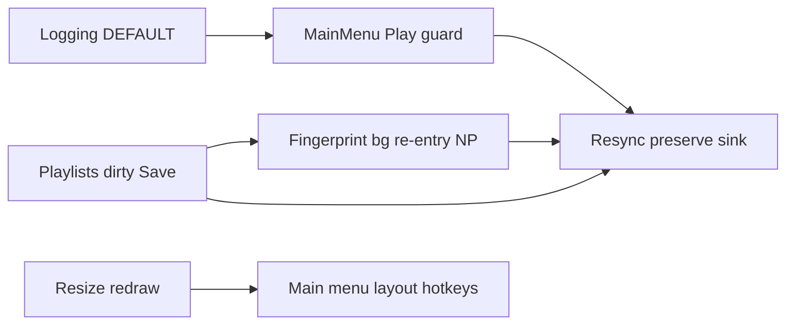

# Техническое задание: доработки OST Player (консолидированный бэклог)

**Версия:** 2026-04  
**Охват:** логирование, Now Playing и плеер, легаси конфига, TUI (resize, главное меню, хоткеи), плейлисты (dirty/save), индексация и производительность скана.

Ключевые модули: `app/src/logging.rs`, `app/src/main.rs`, `app/src/tui/terminal.rs`, `app/src/tui/app.rs`, `app/src/tui/state.rs` (`PlaybackSource`), `app/src/tui/screens/main_menu.rs`, `app/src/player/mod.rs`, `app/src/player/queue.rs`, `app/src/indexer/scan.rs`, `app/src/indexer/io.rs`, `app/src/config/io.rs`, `app/src/tui/ui.rs`.

---

## Сводный чеклист задач

| № | Тема | Кратко |
|---|------|--------|
| 1 | Логирование | Политика DEFAULT: ERROR + whitelist доменных INFO; убрать лишний шум |
| 2 | Now Playing | Guard Play: тот же источник → только экран; изменённый скан → preserve/resync трека |
| 3 | Конфиг | Легаси только для `playlists.yaml`; упростить путь `config.yaml` |
| 4 | TUI resize | Любой `Resize` → немедленная перерисовка |
| 5 | Плейлисты | Сохранение только по Save; dirty + подсказка в главном меню |
| 6 | Главное меню | Короткие названия, блок play/exit, динамическая ширина колонок |
| 7 | Хоткеи UI | Подсказки из `config.yaml` → `hotkeys.bindings` на всех экранах |
| 8 | Индексация | Fingerprint + фоновый debounced rescan для **повторного входа** в NP; ускорение скана |

---

## 1. Логирование

### 1.1. Уровни в конфиге, дефолт DEFAULT

- **Требование:** уровни задаются в `config.yaml` (`logging.default_level`); дефолт — `default` (`LoggingLevel::Default` в `app/src/config/mod.rs`).
- **Сейчас:** `build_env_filter` без `RUST_LOG` задаёт `ost_player=info` для Default (маппинг в `app/src/logging.rs`), т.е. проходят **все** `tracing::info!` крейта.
- **Цель (политика DEFAULT):** в файле по умолчанию — **глобально ERROR/FATAL** и **узкий whitelist** доменных событий, меняющих конфигурацию, **без** прочего INFO (в т.ч. стартовый дамп в `main.rs`).
- **Реализация (выбрать и зафиксировать):** сузить `EnvFilter` по `target`/модулям **или** перевести нецелевые сообщения на `debug!`/`trace!`; `RUST_LOG` — полный оверрайд (`app/src/config/io.rs`).

### 1.2. Доменные INFO (whitelist)

- Логировать на DEFAULT только согласованный перечень: плейлисты (CRUD, overwrite, load с контекстом), настройки, влияющие на сохранённый конфиг.
- Привести к одной политике сообщения вроде «folder added/removed», «folder setting changed» (`app/src/tui/app.rs`): входят ли в whitelist или нет.

### 1.3. Ротация и ретеншен

- **Статус:** реализовано — 3 файла на месяц, удаление старых по `retention_days` (`app/src/logging.rs`).

### 1.4. Комментарии в конфиге

- **Статус:** справка в preamble (`app/src/config/io.rs`).

---

## 2. Now Playing: возврат с главного меню и сохранение воспроизведения

### 2.1. Тот же источник — без перезапуска

- **Требование:** при **Play** с главного меню (`PlayerLoadFromLibrary`), если конфигурация папок + активный плейлист соответствует уже идущему воспроизведению — **только переход на Now Playing**, без скана и без `LoadQueue`.
- **Сейчас:** всегда скан (`app.rs` ~388–414). Guard есть для `LoadPlaylist`, но не для Play с библиотеки.
- **Реализация:** сравнение `playback_source` (`app/src/tui/state.rs`) с `PlaybackSource::from_active_playlist_or_folders(...)`, статус `Playing`/`Paused`. При совпадении — `screen = NowPlaying`, без `request_scan` / `load_queue_from_current_library`.

### 2.2. Базовые границы

- Совпадение источника + `Playing`/`Paused` → только навигация.
- `Stopped` → обычный Play → скан → `load_queue_from_current_library`.

### 2.3. Изменённый скан, тот же файл в подборке — не прерывать трек

- **Требование:** после смены `scan_depth` / `min_size` и т.п. `PlaybackSource` может разойтись, но если **текущий файл** всё ещё в новом списке треков — воспроизведение **не обрывать** (не пересоздавать sink для того же пути).
- **Причина:** `LoadQueue` → `play_at_pos` всегда создаёт новый sink (`app/src/player/mod.rs`).
- **Порядок:** сначала завершение скана и актуальный `LibraryIndex`, затем сравнение путей, затем ветка плеера.

**Архитектура:**

1. После `apply_scan_result` построить список путей новой библиотеки; взять текущий путь из снимка плеера.
2. Если не `Stopped` и путь **есть** в списке — новая команда плеера (условно `ResyncQueueAfterLibraryChange`): обновить `PlayerQueue`, выставить позицию на текущий файл в новом порядке (shuffle), **не** вызывать `play_at_pos`, если путь совпадает с текущим декодированием.
3. Если путь **нет** — обычный `LoadQueue` (**2.3.1**).
4. UX: Next/Prev и «N/M» соответствуют новой очереди.

**Границы:** дубликаты путей; `Paused`; корректная позиция при shuffle.

### 2.3.1. Fallback: файл выпал из подборки

- Обычный `LoadQueue`.
- **Стартовый индекс** (`PlayerQueue::load`): shuffle **off** → `start_index = 0`; shuffle **on** → `random_uniform(0 .. tracks.len())`. RNG тестируемый (seed/инъекция).

### 2.3.2. Почему Play «долго» (дополнение к п. 8.0)

- Полный перескан перед очередью (FIX-004), глубина скана, `metadata`/canonicalize, внешние факторы (диск, АВ).

### Зависимость от п. 5 (dirty)

- Один источник правды для ожидаемого скана: in-memory конфиг vs файл.

---

## 3. Легаси-совместимость

- **Требование:** обратная совместимость формата — **только** для `playlists.yaml` (`app/src/playlists/mod.rs`). `config.yaml` можно пересоздавать без вечной поддержки старых схем.
- **Цель:** сузить легаси к однократной миграции при загрузке; не раздувать путь save; обновить комментарии preamble в `app/src/config/io.rs`.

---

## 4. TUI: resize

- **Требование:** любое изменение размера терминала **сразу** перерисовывает UI (не ждать 1 с / 5 с).
- **Сейчас:** `Event::Resize` в `app/src/tui/terminal.rs` ставит `needs_redraw` в основном при смене minimize (0×0).
- **Цель:** на каждый `Resize` — `needs_redraw = true` (+ prогон `terminal.resize()` при необходимости для ratatui).

---

## 5. Плейлисты: явное сохранение и dirty

### 5.1. Save

- Изменения содержимого плейлиста (включая per-folder `min_size`) в `playlists.yaml` **только** по явной команде **Save** в разделе Playlists.
- **Сейчас:** автосейв в `app.rs` на Create/Rename/Delete/Overwrite/LoadPlaylist.
- **Цель:** in-memory модель + Save; политика при выходе без сохранения (prompt / discard).

### 5.2. Главное меню

- При dirty: пункт **Playlists** выделен, подсказка `(save changes)`, приглушённый зелёный (`draw_main_menu` в `app/src/tui/ui.rs`).

---

## 6. Главное меню: текст и вёрстка

- Сократить **три** названия пунктов (`main_menu_actions_block`, numeric mapping).
- Убрать **5** и **0** из числового блока; отдельный блок **Enter/Space → play**, **Esc/q → exit**; выровнять.
- Ширина колонки Actions — по содержимому без переносов; лишняя ширина — колонке списка папок / Active playlist (сейчас 60/40 в `ui.rs`).
- Согласовать клавиши в `main_menu.rs` (сейчас `5`/`0` = Play/Quit).

---

## 7. Подсказки хоткеев

- Подсказки глобальных действий не хардкодить: `hotkeys.bindings` — play/pause, next/prev, shuffle, repeat, volume up/down.
- **Сейчас:** Now Playing — из конфига; остальные экраны — статичные строки.
- **Цель:** общая сборка строк (как `now_playing_keys_block` + `hotkey_hints`), переиспользование; плейсхолдер для отсутствующих биндингов.

---

## 8. Индексация: фоновый скан для повторного входа в Now Playing

**Область:** фоновое пересканирование и fingerprint — для **повторного входа** на Now Playing и сценариев п. 2.3, чтобы к моменту возврата список треков был готов **где возможно**. Не обязательно универсальный preload перед **каждым** первым Play с главного меню (опциональный follow-up).

**Ускорение обхода:** параллель по корням, меньше syscall; опционально инкременты после профилирования.

### 8.0. Почему скан ощутимо медленный

1. **FIX-004:** перед `LoadQueue` из библиотеки — **обязательный полный перескан** (`app.rs`, комментарий у `PlayerLoadFromLibrary`). Тест `fix_004_play_when_scan_not_running_starts_scan_and_load_queue`: `LoadQueue` только после завершения скана.
2. Кэш `index.yaml` на старте не отменяет этот перескан на первом Play.
3. **OneLevel / Recursive** увеличивают объём I/O поверх того же правила.
4. «Раньше было быстрее» — возможно меньше файлов / другая политика в старых версиях.

### 8.1–8.2. Fingerprint

- Детерминированный отпечаток входа индексатора (пути, `scan_depth`, эффективный min size, фильтры).
- Хранить `index_fingerprint` вместе с индексом.
- Актуальность для **повторного входа** / п. 2.3: если fingerprint совпадает — ветки без блокирующего скана. Первый Play может оставаться под FIX-004 до отдельного решения.

### 8.3. Фоновый rescan (узко)

- Триггеры: смена глубины/`min_size` у папок активного набора; опционально add/remove в потоке «правки → возврат к NP».
- Debounce 100–300 ms; отмена устаревшего in-flight; по завершении — обновление `state.library`, `persist_index_best_effort`.

### 8.4. Устаревший индекс

- Несовпадение fingerprint + неготовый фон — ожидание или блокирующий скан (как сейчас).

### 8.5. Ускорение `scan_library_folders`

- Параллель корней; кэш canonicalize; инкременты — опционально.

### 8.6. Связи

- П. 2.3 требует готовый список — фон готовит его до повторного входа.  
- П. 5 — тот же конфиг для fingerprint.

---

## Зависимости (логическая схема)

---

## Критерии приёмки (сводно)

- DEFAULT-логирование соответствует whitelist; нет лишнего INFO вне него.
- При том же `PlaybackSource` и активном воспроизведении Play с главного меню только открывает Now Playing без скана/очереди.
- После смены параметров скана: если текущий трек остаётся в подборке — нет обрыва; иначе fallback 2.3.1 после готового индекса.
- Любой resize → немедленная отрисовка.
- Плейлисты: только Save на диск; dirty виден в главном меню.
- Хоткеи в UI согласованы с `config.yaml` на всех экранах.
- Главное меню: сокращённые названия, отдельные блоки play/exit, динамическая ширина.
- Легаси конфига — по п. 3.
- Повторный вход / п. 2.3: при совпадении fingerprint без блокирующего скана (п. 8.4); первый Play может следовать FIX-004 до отдельного решения.

---

## Порядок внедрения (рекомендация)

1. Resize (локально, низкий риск).  
2. Логирование (политика + уровни).  
3. Главное меню UX + хоткеи из конфига.  
4. Плейлисты dirty + Save.  
5. Player: `ResyncQueue…` + ветвление в `TuiApp` после скана (2.3, 2.3.1).  
6. Main-menu Play guard (2.1).  
7. Fingerprint + фоновый rescan для re-entry (8).  
8. Легаси `config.yaml` по п. 3.
